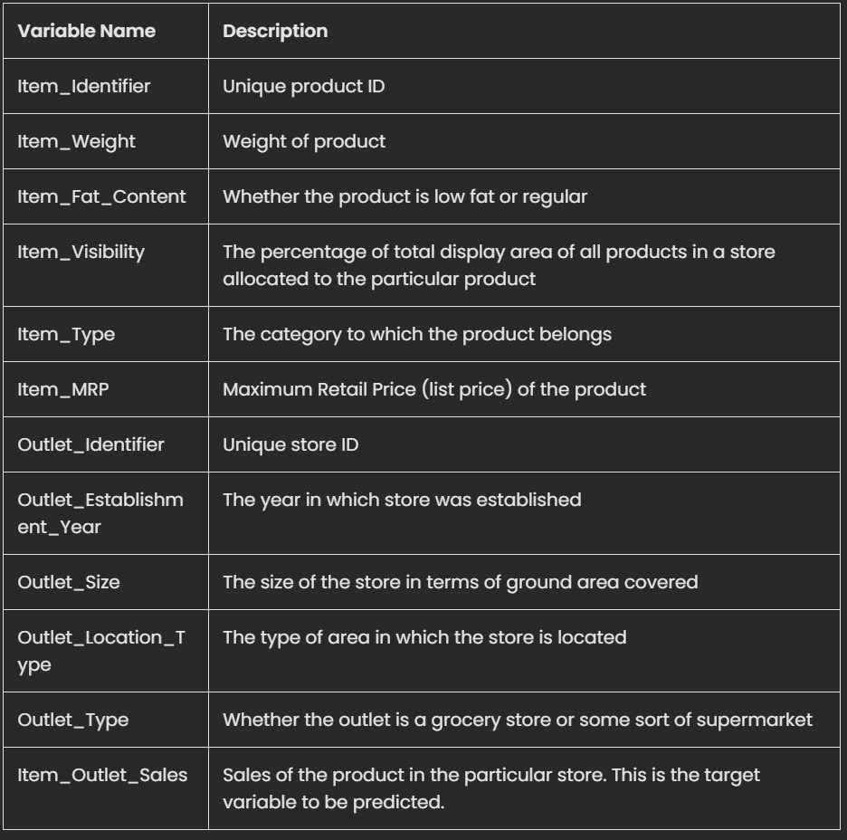
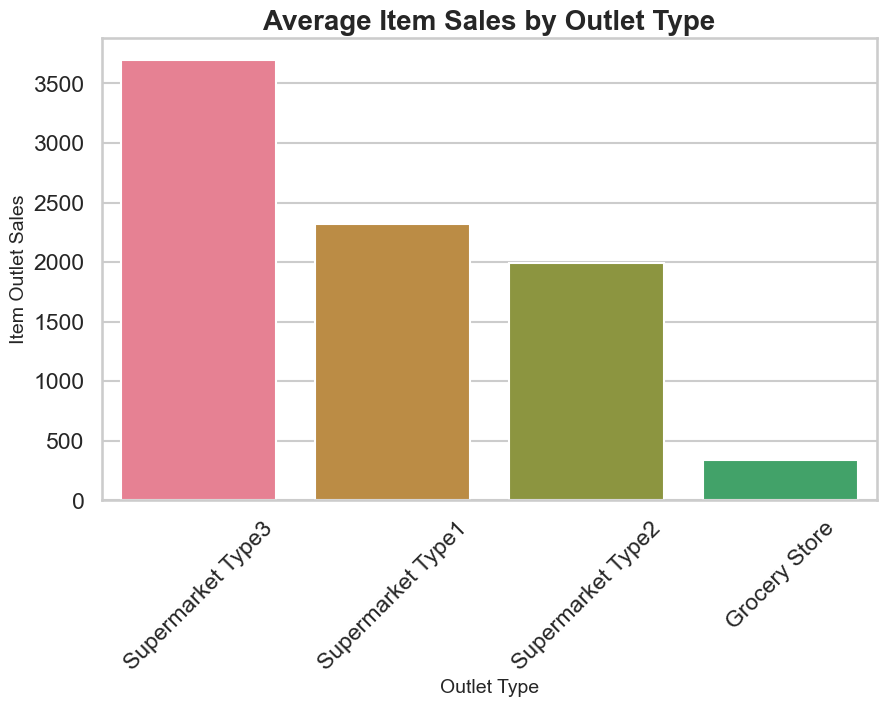
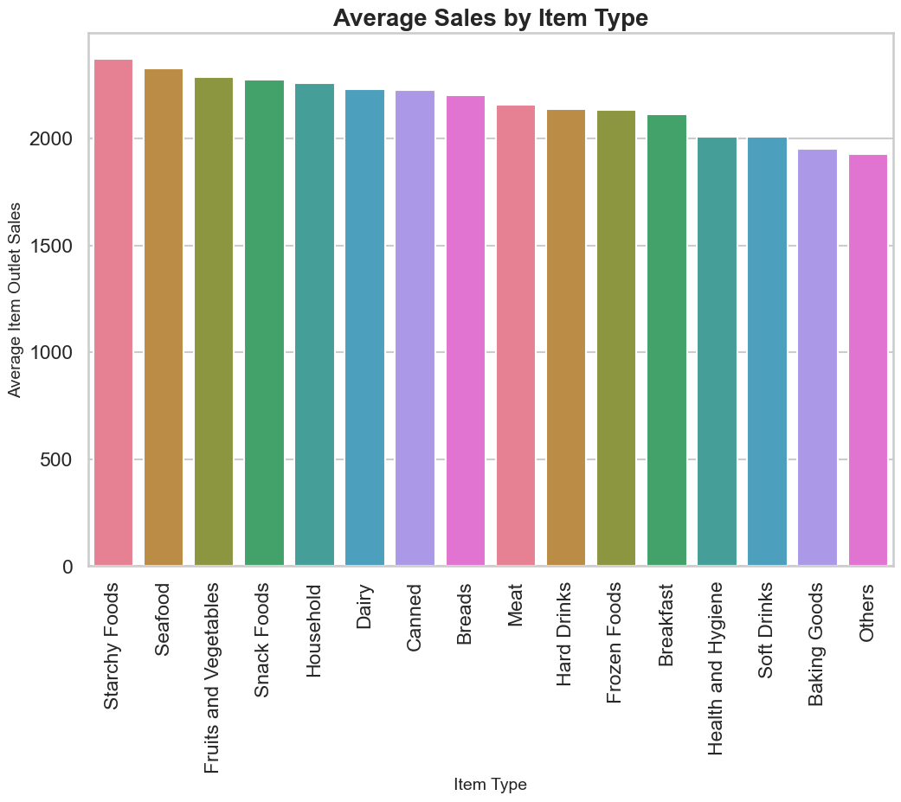

# Food Sales Predictions
## "Unearthing Sales Insights for Strategic Business Decisions

**Charles "Ryne" Daniels**

### Objective:
Our local grocery chain is aiming to stay a step ahead in a volatile market characterized by an unstable supply chain. We aim to unearth and grasp emerging food sales trends, which would enable the store to effectively adapt to changing consumer preferences, re-engineer its business infrastructure, and seize fresh market opportunities. This analysis equips the organization and its stakeholders with valuable insights to boost overall operational efficiency and profitability, while simultaneously cushioning against supply chain vulnerabilities in a fluctuating global backdrop.

### Data Source:
The dataset at our disposal comprises of details pertaining to items sold across various retail outlets, encapsulating attributes of the items, outlet specifics, and sales data. It includes unique identifiers for items, item weights, fat content, visibility, product categories, maximum retail prices, outlet identifiers, establishment years, outlet sizes, location types, outlet types, and revenue generated from item sales for each outlet.

Data Dictionary:

Average Item Sales per Outlet Type

Interpretation: This visualization provides a panoramic view of the average item sales sorted by outlet types, bringing to light the performance disparities among our store types.

Sales by Item Category

Interpretation: This chart illustrates the total sales accrued from each item category. It reveals a broadly uniform distribution of sales across various categories.

Suggested Model for Business Problem
For predicting "item outlet sales," our recommendation to stakeholders would be the third model: the tuned Decision Tree Regressor. It stands out on two key metrics: RMSE and R2.

Lower RMSE: The Root Mean Square Error (RMSE) quantifies the discrepancy between the model's predictions and the actual values. A lower RMSE is indicative of a superior model. In our case, the tuned Decision Tree Regressor surpasses the Linear Regression model by approximately $50.

Higher R2: A higher R2 signifies a model with better predictive power. Our Decision Tree Regressor has a higher R2 score on both the train set (0.60) and test set (0.60) compared to the Linear Regression model's train set (0.56) and test set (0.57).

The Decision Tree Regressor, being a non-linear model, uses a tree structure to render decisions based on input features. It is an apt choice for modeling complex relationships among variables. However, Decision Tree Regressors are susceptible to overfitting, a limitation that can be mitigated by tuning the model. Stakeholders can thus anticipate more accurate forecasts of item outlet sales, facilitating optimization of inventory management, pricing strategies, and marketing initiatives.

For any additional inquiries, please do not hesitate to - [get in touch](mailto:rynedaniels@gmail.com)